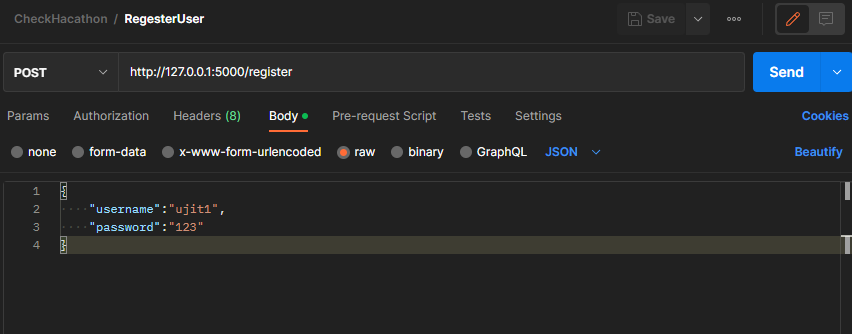
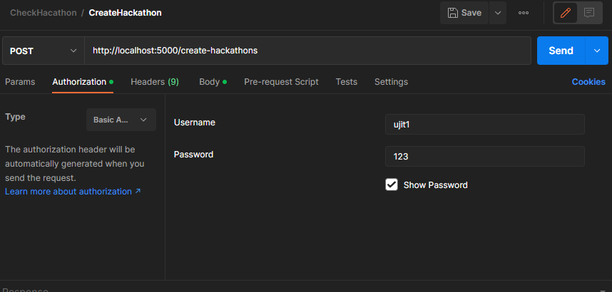
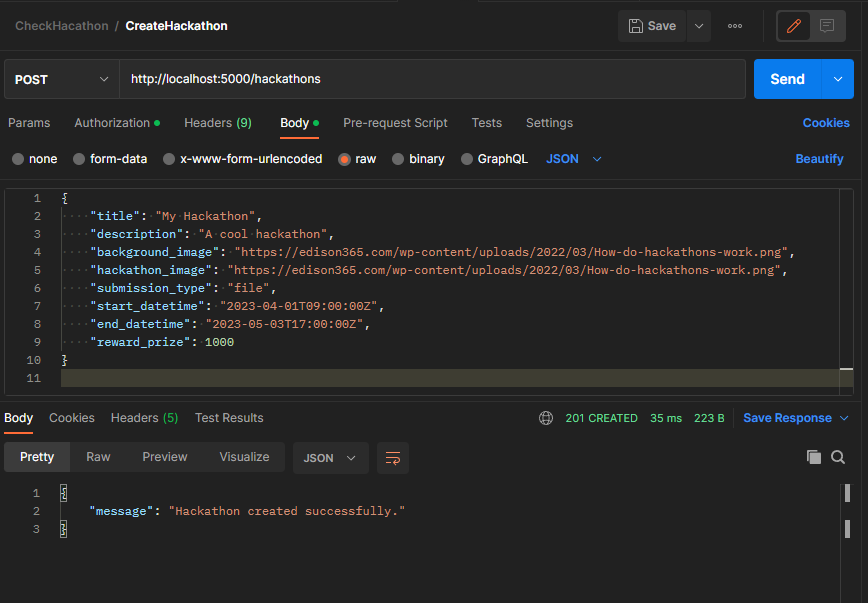
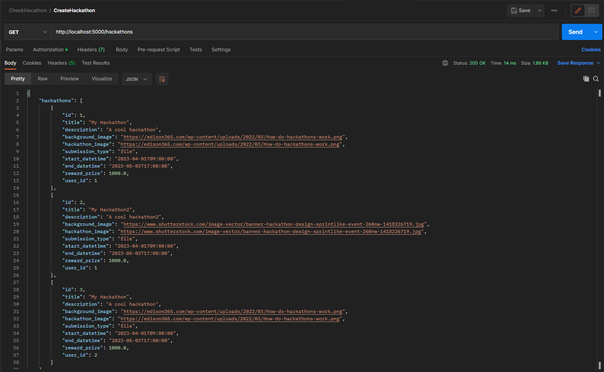
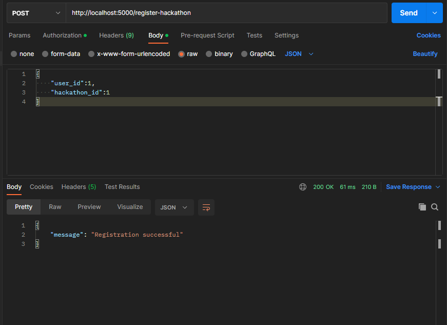
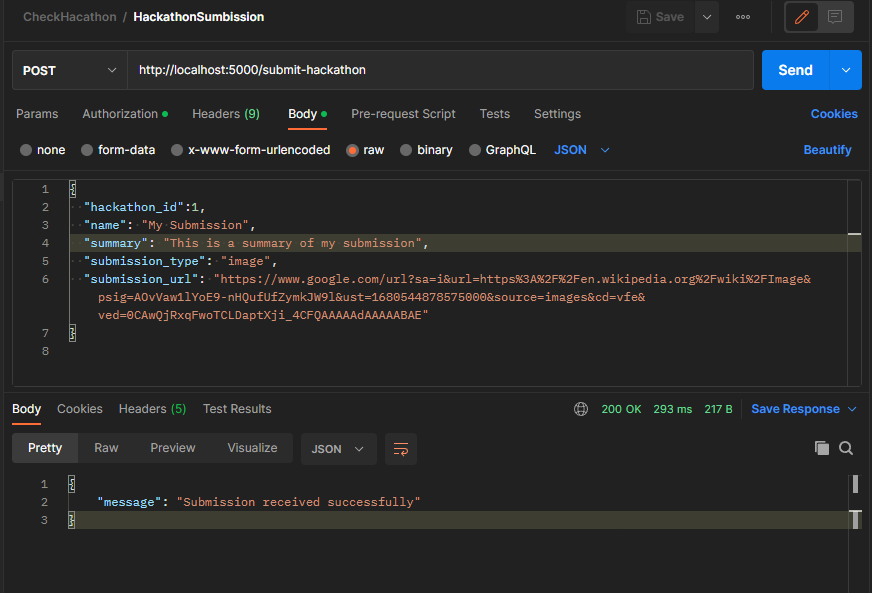
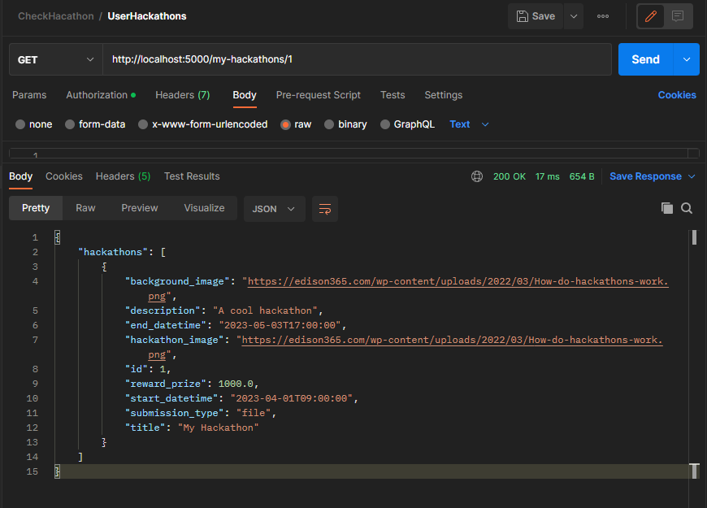
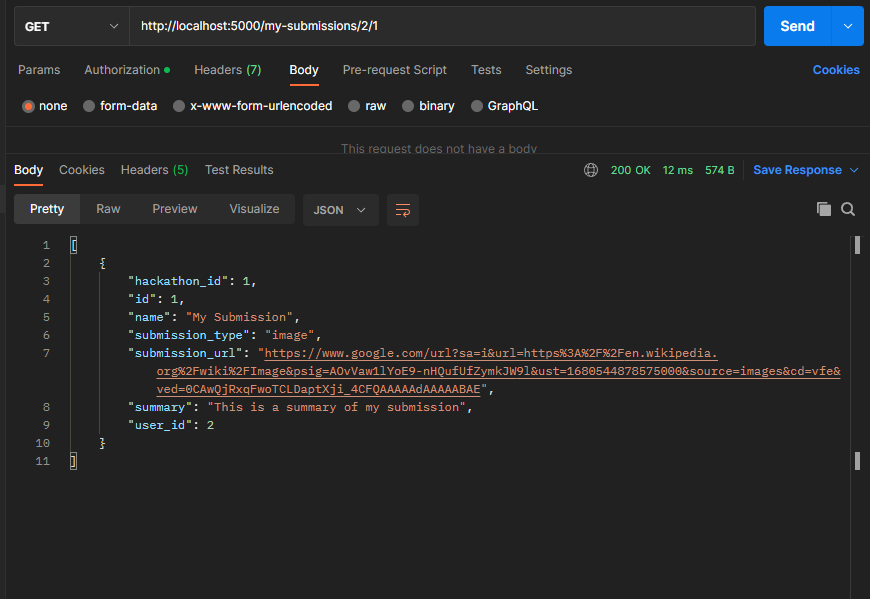

## HackathonAPI: A Python app for managing hackathons and submissions

### Description:

HackathonAPI is a RESTful API that provides endpoints for managing hackathons and submissions. With HackathonAPI, you can create and manage hackathons, track submissions, and award prizes to winners. The API is designed to be easy to use and flexible, allowing you to customize the hackathon rules and submission types to fit your needs. Whether you're hosting a small internal hackathon or a large public competition, HackathonAPI can help streamline the process and make it easier to manage.

### Prerequisites:

1. Python Programming language
2. MySql
3. flask
4. flask_restful
5. json

### Installation:

To install the required packages and libraries, run the following command in your current working directory:

command

pip install -r requirements.txt

This command will install all the necessary dependencies listed in the requirements.txt file, allowing you to run the
project without any issues.

### Usage:

To run the application, execute the following command in the src directory

Command

python main.py

This will start the application, and you should be able to use it. (or) Directly run the main.py file

#### Endpoint Working:

1. **User Registration**(```http://127.0.0.1:5000/register```)

    - Endpoint for creating a new User.
   
      
    - 
    - Example:

      Input:
      ```
      Json_data = {
       "username":"ujit1",
       "password":"123"
      }
      ```

      Output:"message": "User created successfully."

2. **Hackathon Registration**(```http://localhost:5000/create-hackathons```)

    - Endpoint for creating a New Hackathon(POST)

    - Example:
      
      Authorization:
   
     
      
      Working:
   
    - 
     
3. **Retrieving Hackathons**(```http://localhost:5000/create-hackathons```)

    - Endpoint for Retrieving Hackathon(GET)

    - Example:
      
      Authorization:
   
     
      
      Working:
   
    - 

4. **User Registering for Hackathons**(```http://localhost:5000/register-hackathon```)

    - Endpoint for  User Registering for Hackathons

    - Example:
      
      Authorization:
   
     
      
      Working:
   
    - 

4. **User Submission for Hackathons**(```http://localhost:5000/submit-hackathon```)

    - Endpoint for User Submission for Hackathons

    - Example:
      
      Authorization:
   
     
      
      Working:

     

5. **User Submissions for all Hackathons**(```http://localhost:5000/my-hackathons/<int:user_id>```)

    - Endpoint for retrieving the all Submission of a User

    - Example:
      
      Authorization:
   
     
      
      Working:

      

5. **User Submissions for particular Hackathons**(```http://localhost:5000/my-submissions/<int:user_id>/<int:hackathon_id>```)

    - Endpoint for retrieving the particular Submission of a User

    - Example:
      
      Authorization:
   
     
      
      Working:

      
     

```
In addition to the code and documentation, I have included a Postman request file named "CheckHacathon.postman_collection.json" in the "postmanJson" directory.
This file contains a collection of requests that were made using the Postman application, providing a convenient way to test the functionality of the API.
```
### Contact:

Name : Ujit Kumar

Email : ujitkumar1@gmail.com 